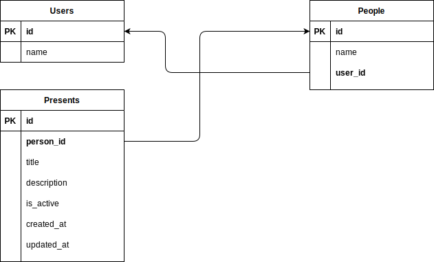

# wish-keeper

Service that allows you to save ideas for presents for your friends and family throughout the year for later use during holidays, birthdays and other occasions.

## How to run it

- Create .env file based on the example
- `nvm use && npm i`
- `docker-compose up // Start postgresql`
- `node scripts/create-db.js // create the db`
- `npx knex migrate:latest // run migrations`
- `npm start`

## Database

